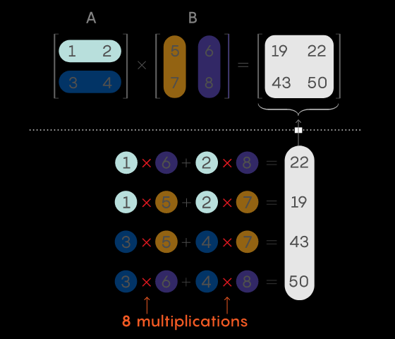
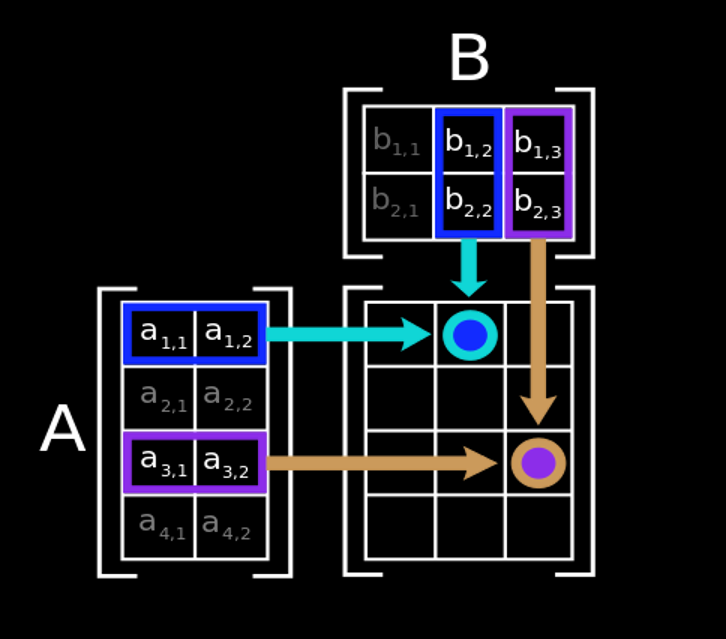
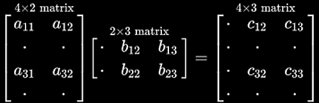
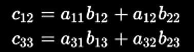

# On Matrix Multiplication

Compiled 2021 by dbj at dbj dot org, License https://dbj.org/license_dbj#]

## The kindergarten method 

Multiplying two two-by-two matrices requires eight multiplications, plus some additions. Generally, this way of multiplying two n-by-n matrices together requires n3 multiplications along the way.



<!-- https://www.quantamagazine.org/mathematicians-inch-closer-to-matrix-multiplication-goal-20210323/ -->

## Illustration

(Mainly nicked from Wikipedia with thanks)

Result matrix rows == A rows, result cols == B cols



That figure illustrates diagrammatically the product of two matrices A and B, showing how each intersection in the product matrix corresponds to a row of A and a column of B.



The values at the intersections marked with circles are:



## C11 and beyond 

(mostly nicked with thanks from ["Modern C"](https://modernc.gforge.inria.fr/) by one Jens Gustedt.)

The most "by-the-book" standard matrix multiplication function is this:

```cpp
void the_most_standard_matrix_mult 
   ( size_t n, size_t k, size_t m,
    double C[n][m] ,
    double A[n][k] ,
    double B[k][m]) 
    {
        for ( size_t i = 0; i < n; ++i) {
            for ( size_t j = 0; j < m; ++j) {
                C[i][j] = 0.0;
            for ( size_t l = 0; l < k; ++l) {
                C[i][j] += A[i][l]*B[l][j];
            }
        }
    }
}
```
One does pass pointers to VLA's into that function. Inside the function, one can use
conventional indexing to access the elements of the matrices. Above is exactly equivalent to:
```cpp
void the_most_standard_matrix_mult ( size_t n, size_t k, size_t m,
            double (C[n]) [m] ,
            double (A[n]) [k] ,
            double (B[k]) [m]) ;
```
And the variant with array pointers:
```cpp
void the_most_standard_matrix_mult ( size_t n, size_t k, size_t m,
            double (*C) [m] ,
            double (*A) [k] ,
            double (*B) [m]) ;
// The parameter types here are 
// pointers to 'rows' or matrices
```
**Notes:**

1. Only the innermost dimension of an array parameter is rewritten by the compiler.
2. Declare length parameters before array parameters.
3. The validity of array arguments to functions must be guaranteed by the programmer.
   1. If the array lengths are known at compile time, compilers may be able to issue warnings. 
   2. But when array lengths are dynamic, be careful!

> Remember: VLA and VMT are executed at runtime not compile time.

### The Matrix Multiplication Dimensions  Requirement

Millions of beginners do regularly stumble on this one. Consider matrix multiplication.
```
A x B = R
```
There are three matrices above: `A`, `B` and `R`. Matrix dimensions for multiplication have to be mutually related as visualised bellow:

```
A(4,2) x B(2,3) = R(4,3)
                              +------+------+------+
                              |      |      |      |
                              |      |      |      |
                              |      |      |      |
A cols == B rows         B    +--------------------+  2 rows
                              |      |      |      |
                              |      |      |      |
                              |      |      |      |
                              +------+------+------+

            2 columns              3 columns

        +------+------+       +------+------+------+  R cols == B cols
        |      |      |       |      |      |      |
        |      |      |       |      |      |      |  R rows == A rows
        |      |      |       |      |      |      |
        +-------------+       +--------------------+
        |      |      |       |      |      |      |
A       |      |      |   R   |      |      |      | 
        |      |      |       |      |      |      |
        +-------------+       +--------------------+
        |      |      |       |      |      |      |
4 rows  |      |      |       |      |      |      |  4 rows
        |      |      |       |      |      |      |
        +------+------+       +------+------+------+
        |      |      |       |      |      |      |
        |      |      |       |      |      |      |
        |      |      |       |      |      |      |
        +------+------+       +------+------+------+
```
Thus the dimensional requirement is:
```
             B cols is unrelated to A
A columns == B rows

R rows    == A rows
R columns == B columns
```
Obviously minimum required dimension to establish the requirement above is:
```
A cols, A rows, B cols
```
`B rows` and both `R` dimensions are calculated from that input. Now, let us repeat the "most obvious function" but this time in a most modern C form:

```cpp
void the_most_standard_matrix_mult 
   ( const size_t a_rows, const size_t a_cols, const size_t b_cols,
    double R[static a_rows][b_cols] ,
    double A[static a_rows][a_cols] ,
    double B[static a_cols][b_cols])  /* B rows == A cols */
    {
        for ( size_t i = 0; i < a_rows; ++i) {
            for ( size_t j = 0; j < b_cols; ++j) {
                R[i][j] = 0.0;
            for ( size_t l = 0; l < a_cols; ++l) {
                R[i][j] += A[i][l]*B[l][j];
            }
        }
    }
}
```
"The most obvious function", has arguments provided so that matrix dimension are enforced, to follow that dimension related rule above. 

Be careful to call such a function with properly allocated matrices and properly set dimensions.
```cpp
/*
A columns == B rows
R rows    == A rows
R columns == B columns
*/
size_t a_rows = 3,      a_cols = 2 , 
       b_rows = a_cols, b_cols = 4, 
       r_rows = a_rows, r_cols = b_cols ;
                                                          // R * C
int A[a_rows][a_cols] = {{1,2},{3,4},{5,6}} ;             // 3 * 2
int B[b_rows][b_cols] = {{1,2,3,4},{5,6,7,8},{9,0,1,2}} ; // 3 * 4
int R[r_rows][r_cols] = {{0,0,0,0},{0,0,0,0},{0,0,0,0}} ; // 3 * 4

the_most_standard_matrix_mult(a_rows,a_cols,b_cols,A,B,R) ;

// result is in R

```
A bit more descriptive variable names always do help.
