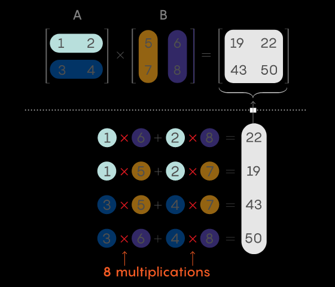
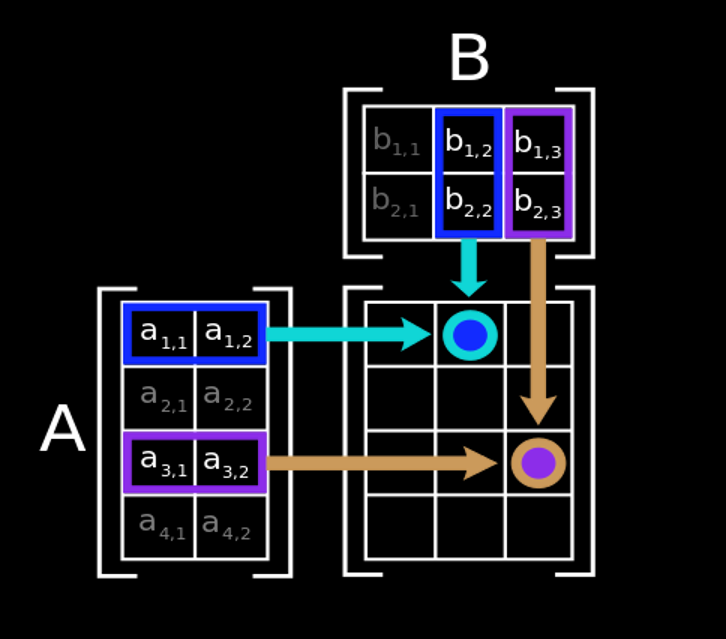
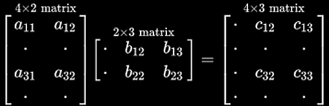
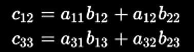

## The textbook method 

for multiplying two-by-two matrices requires eight multiplications, plus some additions. Generally, this way of multiplying two n-by-n matrices together requires n3 multiplications along the way.

<!-- https://www.quantamagazine.org/mathematicians-inch-closer-to-matrix-multiplication-goal-20210323/ -->

## Illustration

Rezult matrix rows == A rows, cols == B cols

That figure illustrates diagrammatically the product of two matrices A and B, showing how each intersection in the product matrix corresponds to a row of A and a column of B.

The values at the intersections marked with circles are:

